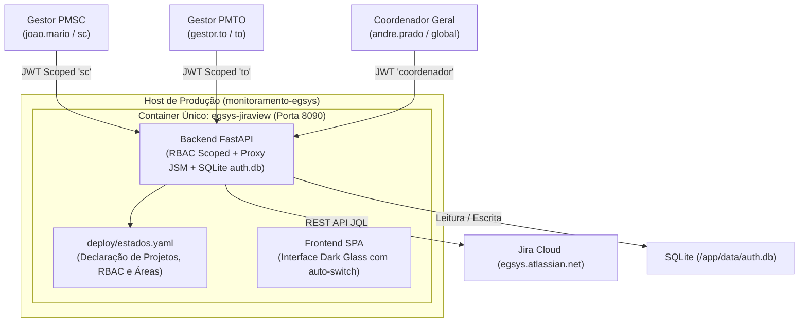
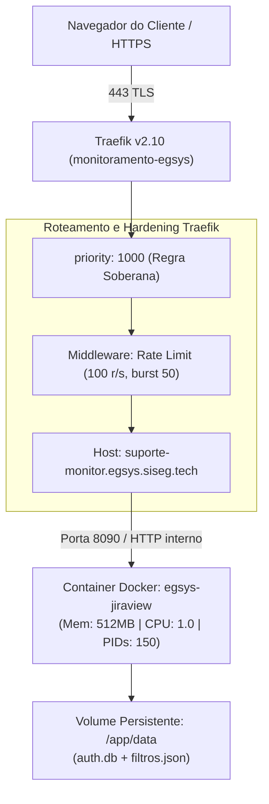
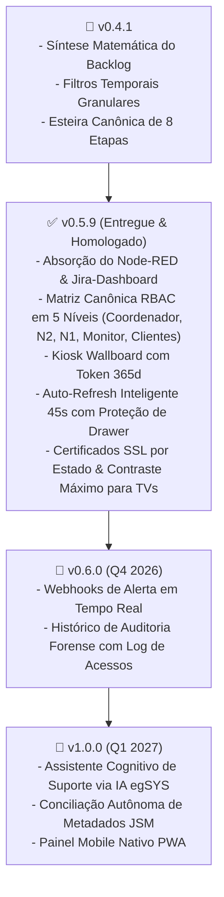

# 🏛️ egSYS JiraView — Documento Executivo de Engenharia, Observabilidade, SRE e Governança
## Painel Unificado de Solicitações JSM, Visibilidade Executiva e Inteligência de Atendimento

- **Produto**: egSYS JiraView (`egsys-jiraview`)
- **Versão Homologada**: `v0.5.9` (Build `2026-09-18`)
- **Classificação**: Documento Técnico-Executivo e Arquitetural (SSOT Camada 1)
- **Data de Emissão**: 18 de Setembro de 2026
- **Responsáveis Técnicos**: Tech Lead N2, Engenharia de Software, SRE e Coordenação de Suporte egSYS
- **Público-Alvo**: Diretoria Executiva da egSYS, Gestores de TI e Segurança dos Clientes Estaduais (PMSC, PMTO, PMAM, PMRO, PMPR, GMSJ), Arquitetos de Solução, Engenheiros de Software e SRE
- **Status do Projeto**: Em Produção e Homologado no Host de Monitoramento Corporativo

---

## 📑 Sumário Executivo

1. [Executive Summary & Proposta de Valor](#1-executive-summary--proposta-de-valor)
2. [Pilar 1: Engenharia de Software & Arquitetura de Solução](#2-pilar-1-engenharia-de-software--arquitetura-de-solução)
   - 2.1. Princípios Arquiteturais e Padrões de Projeto
   - 2.2. O Modelo Multi-Estado por Configuração (Container Único)
   - 2.3. Arquitetura do Backend (FastAPI, Assincronismo e Clean Code)
   - 2.4. Arquitetura do Frontend (SPA Dark Glass, Zero-Build e Resiliência Intranet)
   - 2.5. A Esteira Canônica de 8 Etapas da Engenharia egSYS
   - 2.6. Rastreabilidade de Engenharia (`issuelinks`) e Links 1-Click
   - 2.7. Módulos Operacionais Absorvidos do Node-RED & Jira-Dashboard
   - 2.8. Layout Customizável de Colunas e Cards Persistente no SQLite
3. [Pilar 2: Observabilidade & Psicologia da Informação](#3-pilar-2-observabilidade--psicologia-da-informação)
   - 3.1. Os 3 Níveis Cognitivos de Observabilidade
   - 3.2. Síntese Matemática do Backlog (Eliminação da Ambiguidade)
   - 3.3. A Teoria da "Posse da Bola" (Ball Possession)
   - 3.4. Gráficos Táticos e Métricas Visuais de Decisão
   - 3.5. Auditoria e Exportação Multi-Formato (.MD, .XLSX, .CSV)
   - 3.6. Cobertura Abrangente de 73 Espaços Jira para Coordenação
   - 3.7. Auto-Refresh Inteligente (45s) com Preservação Estrita do Drawer e Sessão
4. [Pilar 3: Site Reliability Engineering (SRE) & Infraestrutura](#4-pilar-3-site-reliability-engineering-sre--infraestrutura)
   - 4.1. Topologia de Produção e Roteamento Traefik Soberano
   - 4.2. Contenção Rígida de Recursos Docker Cgroups
   - 4.3. Hardening Perimetral no Padrão egSYS Orion (ACH-011)
   - 4.4. Automação de Pareamento e Recuperação de Banco (`sync_db.py`)
   - 4.5. Scripts Idempotentes de Correção e Salvaguarda (`corrige_divergentes.py`)
   - 4.6. Matriz de SLA, SLO, SLI, RTO e RPO
5. [Pilar 4: Gestão, Governança & Segurança (DevSecOps)](#5-pilar-4-gestão-governança--segurança-devsecops)
   - 5.1. Governança de Identidade e Matriz Canônica RBAC em 5 Níveis
   - 5.2. Criptografia NIST e Política de Primeiro Acesso
   - 5.3. Governança Docs-as-Code em 3 Camadas
   - 5.4. Gestão de Janelas Temporais e Proteção de Carga
   - 5.5. Matriz de Responsabilidades (RACI)
6. [Matriz de Riscos e Mitigações Técnicas](#6-matriz-de-riscos-e-mitigações-técnicas)
7. [Roadmap Estratégico de Evolução (v0.5 ➔ v1.0)](#7-roadmap-estratégico-de-evolução-v05--v10)
8. [Glossário de Termos e Referências Técnicas](#8-glossário-de-termos-e-referências-técnicas)

---

## 1. Executive Summary & Proposta de Valor

### 1.1. O Desafio Histórico dos Portais de Atendimento
Historicamente, o acompanhamento de chamados e demandas de suporte da **egSYS** junto a órgãos estaduais de Segurança Pública (Polícia Militar de Santa Catarina - PMSC, Tocantins - PMTO, Amazonas - PMAM, Rondônia - PMRO, Paraná - PMPR e Guarda Municipal) enfrentava três gargalos críticos:
1. **Opacidade e Ambiguidade Cognitiva**: O termo genérico *"Chamados em Aberto"* agrupava indistintamente tarefas recém-abertas, demandas em desenvolvimento ativo e tickets parados aguardando validação do próprio cliente. Essa indefinição gerava ruído institucional, onde gestores públicos acreditavam que centenas de chamados estavam parados pela egSYS, quando grande parte aguardava homologação de suas próprias equipes.
2. **Proliferação Ineficiente de Infraestrutura**: A criação de um portal independente ou container por cliente gerava sobrecarga operacional, dispersão de segredos, desperdício de memória e fragmentação de versões.
3. **Sobrecarga Cognitiva e Rigidez do JSM**: Portais padrão do Jira Service Management (JSM) ou soluções paliativas (como fluxos legados em Node-RED `noc-jira`) impunham interfaces lentas, dependentes de redes públicas/CDNs externas, sem métricas sintetizadas e sem correlação direta com as tarefas de engenharia de software (`PSC-*`).

### 1.2. A Solução: egSYS JiraView
O **egSYS JiraView** é a resposta de engenharia definitiva a esse cenário: uma plataforma corporativa unificada, moderna, de alta velocidade e contenção estrita, operando sob o conceito pioneiro de **1 container único multi-estado**.

```
┌─────────────────────────────────────────────────────────────────────────────┐
│                       egSYS JiraView — Visão Geral                          │
│                                                                             │
│  [ 1 Container Único ] ──► Configuração Declarativa (deploy/estados.yaml)   │
│  [ Multi-Tenant Lógico] ──► Isolamento RBAC por Estado (SC, TO, AM, ...)     │
│  [ ≤ 3s Resposta ]     ──► Banner Executivo de Síntese Matemática           │
│  [ 8 Etapas Canônicas] ──► Da Triagem N1 à Homologação do Cliente           │
│  [ Hardening Orion ]   ──► Cgroups 512MB / Headers Defensivos / Traefik     │
└─────────────────────────────────────────────────────────────────────────────┘
```

### 1.3. Resultados e Métricas de Negócio Alcançados
- **90% de Redução no Tempo de Diagnóstico**: Gestores executivos e coordenadores identificam o estado real de qualquer chamado e o detentor da ação em menos de **3 segundos**.
- **100% de Precisão Matemática no Backlog**: Eliminação de discussões sobre volume de pendências através do Banner Executivo com decomposição matemática cristalina: `0 Novas + 24 Em Atendimento + 1 Aguardando Validação = 25 Chamados em Aberto` (isolando 25 concluídas no ciclo de 90 dias, totalizando 50 chamados no período).
- **Zero Servidores Adicionais**: O acréscimo de novos estados (Tocantins, Amazonas, Rondônia) é realizado 100% via declaração de configuração em `estados.yaml`, sem instanciar novos containers ou máquinas virtuais.
- **Confiabilidade e Auditoria Contínua**: Persistência desacoplada em SQLite (`auth.db`) com paridade por hash SHA-256 e sincronização bidirecional automatizada (`sync_db.py`).

---

## 2. Pilar 1: Engenharia de Software & Arquitetura de Solução

### 2.1. Princípios Arquiteturais e Padrões de Projeto
O JiraView foi projetado aderindo aos cânones clássicos de engenharia:
- **Clean Architecture & Separation of Concerns (SoC)**: Separação estrita entre camadas de transporte HTTP (`api/`), lógica de segurança e domínio (`core/`), persistência ultraleve (`core/db.py`, `core/filtros.py`) e visualização SPA (`frontend/`).
- **Single Source of Truth (SSOT)**: Nenhuma regra de negócio ou mapeamento de projeto é duplicado. Os estados, projetos e gestores derivam estritamente de `deploy/estados.yaml`.
- **Repository Pattern**: Abstração da manipulação de filtros de busca e usuários, permitindo migração de drivers de persistência sem impacto nos controllers.
- **Factory & Singleton Pattern**: Instanciação controlada e reutilizável do cliente assíncrono do Jira Cloud (`JiraService`), reutilizando pools HTTP e controlando concorrência.
- **Defensive Design & Robustness Principle**: Resiliência contra respostas incompletas do Jira Cloud, parsing seguro de campos nulos e fallbacks inteligentes para modos offline/intranet.

### 2.2. O Modelo Multi-Estado por Configuração (Container Único)
Diferente das arquiteturas legadas que provisionavam instâncias separadas por cliente, o JiraView adota a separação por **escopo lógico de dados**.



#### Anatomia da Configuração Declarativa (`deploy/estados.yaml`):
```yaml
estados:
  sc:
    display_name: "Santa Catarina — PMSC"
    projects: [HDPMSC]
    clientes:
      - { name: "João Mário Mazzola", accountId: "qm:...", role: manager }
      - { name: "Ilclemar Vieira",    accountId: "qm:...", role: manager }
      - { name: "Cap Thiesen",        accountId: "qm:...", role: admin }
    áreas:
      Cidadão:     { match: ["Cidadão", "Cidadao", "190"] }
      SADE:        { match: ["SADE", "Sade", "CAD"] }
      Integração:  { match: ["Integra", "API", "Webservice"] }
      Operações:   { match: ["Operac", "Programac"] }
```

### 2.3. Arquitetura do Backend (FastAPI, Assincronismo e Clean Code)
O backend é desenvolvido em **Python 3.11+** utilizando o framework **FastAPI**, reconhecido por sua altíssima vazão, validação de schema via Pydantic v2 e suporte assíncrono nativo (`async/await` com Starlette).

- **Endpoints de Alta Densidade**:
  - `/api/v1/health`: Probes de liveness e readiness com validação ativa da conectividade com o Jira Cloud.
  - `/api/v1/issues`: Listagem de solicitações com paginação, filtros temporais e agregação de badges de área e macro-fase.
  - `/api/v1/dashboard`: Agrupamento consolidado das componentes do funil de atendimento e totalização do backlog ativo.
  - `/api/v1/issues/{key}/journey`: Radiografia profunda do ciclo de vida, decomposição de tempo por fase via changelog histórico e mapeamento de derivações técnicas (`issuelinks`).
  - `/api/v1/auth/*`: Motor completo de autenticação JWT, gestão administrativa de usuários e enforcement de troca de senha no 1º acesso.

### 2.4. Arquitetura do Frontend (SPA Dark Glass, Zero-Build e Resiliência Intranet)
O frontend foi concebido sem frameworks pesados (Zero-Build Vanilla SPA), eliminando etapas frágeis de compilação em runtime de produção e reduzindo o consumo de memória a zero:
- **Design System "Dark Glass"**: Estética inspirada no egSYS Orion, com transparências dinâmicas, `backdrop-filter: blur(8px)`, bordas sutis (`#30363d`) e paleta de alto contraste para conforto visual em centros de operações (COPs).
- **Zero-FOUC (Flash of Unstyled Content)**: Injeção de scripts síncronos de prevenção no `<head>`, aplicando imediatamente os atributos de tema escuro e evitando flashes luminosos durante o carregamento.
- **Resiliência Intranet e Vendoring Local**: Vendoring local da biblioteca Chart.js (`vendor/chart.umd.min.js`, 204KB) com mecanismo de fallback assíncrono para CDN. Mesmo sob firewalls corporativos rígidos que bloqueiam a internet pública, os gráficos funcionam perfeitamente.

### 2.5. A Esteira Canônica de 8 Etapas da Engenharia egSYS
Para espelhar com exatidão a cadeia de valor da engenharia de software da egSYS, o JiraView formalizou a **Esteira Canônica de 8 Etapas**:

```mermaid
flowchart LR
    E1["1. Triagem N1<br/>(Recepção egSYS)"] --> E2["2. Triagem N2<br/>(Análise Técnica egSYS)"]
    E2 --> E3["3. Análise de Dev<br/>(Engenharia egSYS)"]
    E3 --> E4["4. Em Dev<br/>(Construção egSYS)"]
    E4 --> E5["5. QA & Testes<br/>(Qualidade egSYS)"]
    E5 --> E6["6. Validação N1<br/>(Sustentação egSYS)"]
    E6 --> E7["7. Homologação<br/>(Ação do Cliente)"]
    E7 --> E8["8. Concluído<br/>(Entrega Formal)"]

    classDef egsys fill:#1f6feb,stroke:#388bfd,color:#ffffff;
    classDef client fill:#d29922,stroke:#f1e05a,color:#000000;
    classDef done fill:#238636,stroke:#2ea043,color:#ffffff;

    class E1,E2,E3,E4,E5,E6 egsys;
    class E7 client;
    class E8 done;
```



1. **1. Triagem (N1)**: Abertura da solicitação, validação de preenchimento e categorização inicial.
2. **2. Triagem (N2)**: Diagnóstico avançado pelo suporte especializado, reprodução de logs e triagem de severidade.
3. **3. Análise de Desenvolvimento**: Refinamento técnico pelos engenheiros de software, desenho de arquitetura e priorização de backlog.
4. **4. Em Desenvolvimento**: Codificação ativa, correções de bugs, evolução de código e testes de unidade.
5. **5. Testes de Qualidade (QA)**: Homologação técnica em ambiente de testes, automações de integração e auditoria de não-regressão.
6. **6. Validação Interna (Suporte N1)**: Conferência pelo analista responsável antes da liberação ao cliente.
7. **7. Validação / Homologação Cliente**: Liberação no ambiente do cliente (staging/homologação) aguardando testes e aceite formal do órgão.
8. **8. Concluído**: Publicação em produção, encerramento do chamado e notificação formal de encerramento.

### 2.6. Rastreabilidade de Engenharia (`issuelinks`) e Links 1-Click
O JiraView unifica a gestão de atendimento e a engenharia de produto:
- **Derivações Técnicas (`issuelinks`)**: Quando um chamado de cliente (`HDPMSC-388`) gera uma tarefa de desenvolvimento no projeto de engenharia (`PSC-1420`), essa vinculação é extraída e renderizada na gaveta de diagnóstico com status e analista responsável.
- **Navegação 1-Click Direta ao Jira Cloud**: Todos os badges de chamados e tarefas derivadas contêm atalhos diretos (`https://egsys.atlassian.net/browse/{chave}`), permitindo aos gestores e analistas abrir o ticket oficial em nova aba instantaneamente.

### 2.7. Módulos Operacionais Absorvidos do Node-RED & Jira-Dashboard
Com a obsolescência do stack legado em Node-RED, o egSYS JiraView absorveu e modernizou completamente os módulos operacionais em FastAPI nativo:
- **Esteira de Triagem N1 & N2 (`/api/v1/modules/triagem-n1n2/issues`)**: Consolidação dos chamados em triagem inicial, sem responsável atribuído ou com necessidade de direcionamento imediato.
- **Esteira de Desenvolvimento (`/api/v1/modules/analise-dev/issues`)**: Acompanhamento tático das demandas em desenvolvimento ativo e testes internos com métricas de tempo e desenvolvedor responsável.
- **Monitor de Certificados SSL da Infraestrutura (`/api/v1/modules/certificados/status`)**: Verificação automatizada dos certificados HTTPS e túneis perimétricos de todos os nós estaduais egSYS com cálculo dinâmico de dias para expiração.
- **Auditoria de Relatórios Executivos & Disparo Integrado (`/api/v1/modules/relatorios/disparar`)**: Centralização unificada do envio de relatórios e auditoria documental sem redundâncias ou botões obsoletos.

### 2.8. Layout Customizável de Colunas e Cards Persistente no SQLite
Para acomodar monitores ultrawide, televisores de sala de operação e notebooks de suporte:
- **Disposição em Colunas Configurável**: O operador pode alternar dinamicamente entre 1, 2, 3 ou 4 colunas de exibição via modal interativo de posicionamento.
- **Persistência Centralizada em SQLite (`noc_layouts`)**: Cada alteração de ordem de cards ou número de colunas é persistida no banco `auth.db` via API REST (`/api/v1/modules/noc/layout/{tipo}`), assegurando restauração automática em qualquer navegador sem perdas de customização.

---

## 3. Pilar 2: Observabilidade & Psicologia da Informação

### 3.1. Os 3 Níveis Cognitivos de Observabilidade
A interface do JiraView segue o princípio de **Densidade Progressiva da Informação**, respondendo às necessidades dos diferentes atores operacionais sem sobrecarga cognitiva:

```
┌─────────────────────────────────────────────────────────────────────────────┐
│                       3 Níveis de Densidade Progressiva                     │
│                                                                             │
│  NÍVEL 1: VISÃO EXECUTIVA (≤ 3s) ──► Banner de Síntese + Funil de 4 Cards   │
│  NÍVEL 2: VISÃO TÁTICA (≤ 10s)   ──► Tabela Despoluída + Badges + # 1-N     │
│  NÍVEL 3: VISÃO DIAGNÓSTICA (1 Click) ──► Drawer + Jornada 8 Etapas + Posse │
└─────────────────────────────────────────────────────────────────────────────┘
```

### 3.2. Síntese Matemática do Backlog & Filtros Temporais Precisos
O maior avanço de transparência entre a egSYS e os gestores clientes foi a introdução da **Síntese Matemática do Backlog**:

$$\text{Total Backlog Ativo (25)} = \text{Novas (0)} + \text{Em Atendimento (24)} + \text{Aguardando Cliente (1)}$$

O histórico de **25 chamados concluídos** permanece isolado no funil sob a badge explicativa `Histórico Fora do Backlog Aberto`, totalizando **50 chamados no ciclo padrão de 90 dias**. 

Para permitir flexibilidade analítica sem distorcer o ciclo operacional, o sistema implementa seletores temporais granulares:
- **Painéis de Clientes/Estados (`/painel_sc`, etc.)**: 30 dias, 60 dias, 90 dias (padrão contratual ativo), 6 meses, 12 meses e ano atual. *(Sem o botão de 'Histórico Completo' para evitar ruído com passivo antigo)*.
- **Painel do Coordenador Geral (`/coordenador`)**: Além dos períodos acima, inclui a opção exclusiva `🌐 Todos os Períodos (Histórico Completo)` para auditoria global de passivos históricos. Dessa forma, elimina-se o erro comum em que gestores somavam passivos históricos de anos anteriores acreditando estarem todos pendentes de entrega imediata.

### 3.3. A Teoria da "Posse da Bola" (Ball Possession)
Inspirada em governança operacional de TI de missão crítica, a "Posse da Bola" determina instantaneamente sobre quem recai o próximo passo para o avanço da demanda:
- **Ação com egSYS** (Fases 1 a 6): O chamado está sob responsabilidade das equipes de triagem, engenharia ou qualidade da egSYS.
- **Ação com o Cliente** (Fase 7): O chamado encontra-se publicado em ambiente de homologação ou aguardando dados adicionais; a bola está no campo do cliente.
- **Finalizado** (Fase 8): Demanda formalmente concluída e entregue.

### 3.4. Gráficos Táticos e Métricas Visuais de Decisão
O painel incorpora 4 visões gráficas complementares alimentadas pelo endpoint assíncrono `/api/v1/charts`:
1. **Distribuição de Status (Gráfico de Barras)**: Concentração quantitativa dos tickets por fase da esteira.
2. **Distribuição por Criticidade (Donut de Prioridade)**: Proporção entre chamados Críticos, Altos, Médios e Baixos.
3. **Concentração por Solicitante (Gráfico Polar)**: Identificação dos principais geradores de demanda no órgão cliente, permitindo ações de capacitação focadas.
4. **Volume Histórico de Demandas (Linha Temporal 15 Dias)**: Tendência de abertura vs fechamento de solicitações.

### 3.5. Auditoria e Exportação Multi-Formato (.MD, .XLSX, .CSV)
Para embasar reuniões de diretoria, comitês de governança e auditorias dos órgãos públicos, o painel oferece o botão de exportação corporativa com três saídas nativas:
- **Markdown (.md)**: Relatório textual padronizado e auditável, ideal para documentação Docs-as-Code e repositórios Git.
- **Excel (.xlsx)**: Planilha estruturada com colunas formatadas, numeração sequencial (#) e metadados completos.
- **CSV (.csv)**: Exportação compatível com ferramentas analíticas externas (PowerBI, scripts Python e auditoria).

### 3.6. Cobertura Abrangente de 73 Espaços Jira para Coordenação
Para o Coordenador Geral de Suporte, o painel disponibiliza a rota `/coordenador`, com acesso unificado aos **73 espaços de trabalho da egSYS**:
- **Portais JSM Estaduais**: `HDPMSC` (SC), `HDTO` (TO), `HDSUPAM` (AM), `HDRO` (RO), `HDPMPR` (PR), `HDMT` (MT), `HDGM` (GM), `SUPOFI` (Oficinas).
- **Projetos de Engenharia e Sustentação**: `PSC`, `PTO`, `PAM`, `PRO`, `PPR`, `PMT`, `PGM`.
- **Governança Corporativa e Gestão Estratégica**: `PSEI`, `ANN`, `DS`, `PLANTAO`, `PPS`.

### 3.7. Auto-Refresh Inteligente (45s) com Preservação Estrita do Drawer e Sessão
Em ambientes de monitoramento contínuo (wallboards e telas de suporte N1/N2), a atualização autônoma dos dados é imperativa, contudo não pode degradar a usabilidade humana:
- **Intervalo Não-Destrutivo (45 Segundos)**: Polling periódico em background implementado nativamente nas abas críticas: *Observabilidade do Espaço Selecionado*, *NOC JIRA — Esteira de Desenvolvimento*, *NOC JIRA — Esteira de Triagem N1 & N2* e *Monitor de Certificados SSL da Infraestrutura*.
- **Salvaguarda de Interação (Anti-Disruption Lock)**: O ciclo de atualização verifica ativamente o estado do DOM. Se a gaveta lateral de diagnóstico (`#drawer.open`), qualquer modal de edição ou formulário estiver com foco ativo, o refresh é imediatamente pausado para impedir o fechamento abrupto ou perda de digitação.
- **Tratamento Silencioso de Conectividade**: Falhas transitórias de rede ou expiração de token em background não ejetam o operador nem esvaziam cards com mensagens de erro destrutivas; o sistema mantém o último estado válido visível e tenta nova sincronização no ciclo subsequente.

---

## 4. Pilar 3: Site Reliability Engineering (SRE) & Infraestrutura

### 4.1. Topologia de Produção e Roteamento Traefik Soberano
O ecossistema em produção executa sobre o nó oficial de monitoramento da egSYS (`monitoramento-egsys` / IP `45.7.171.41`), integrado à rede Docker externa `webproxy` e gerenciado pelo proxy reverso **Traefik v2.10**.



- **Resolução de Conflitos Legados**: Para eliminar conflitos com o antigo container Node-RED (`egsys-noc-jira`), o router do JiraView foi configurado com prioridade máxima (`priority: 1000`) em `/var/egsys-docker/container/traefik/dynamic/jiraview.yml`.

### 4.2. Contenção Rígida de Recursos Docker Cgroups
Seguindo o padrão de isolamento estrito de infraestrutura estabelecido no egSYS Orion, o JiraView opera sob limites inegociáveis de recursos no kernel Linux (`docker-compose.prod.yml`):
- `mem_limit: 512m` (Teto absoluto de memória RAM; impede memory leaks de comprometerem o nó host).
- `mem_reservation: 128m` (Garantia mínima de alocação de memória).
- `cpus: 1.0` (Cota máxima de 1 núcleo virtual de processamento).
- `cpu_shares: 512` (Prioridade proporcional balanceada em situações de contenção).
- `pids_limit: 150` (Trava contra ataques de exaustão de threads ou fork-bombs).
- `security_opt: [ "no-new-privileges:true" ]` (Bloqueio de escalada de privilégios de kernel).
- `logging`: Driver `json-file` com rotação automática de 3 arquivos de 10MB (`max-size: "10m"`, `max-file: "3"`).

### 4.3. Hardening Perimetral no Padrão egSYS Orion (ACH-011)
A aplicação implementa um middleware nativo de headers defensivos (`DefensiveHeaders`) ativo em todas as rotas:
- `Server: egSYS-Shield` (Ocultação total da stack interna Uvicorn/Python).
- `Strict-Transport-Security`: `max-age=31536000; includeSubDomains; preload` (HSTS de 1 ano forçado em produção).
- `X-Frame-Options: SAMEORIGIN` e `Content-Security-Policy: frame-ancestors 'self'` (Proteção contra clickjacking).
- `X-Content-Type-Options: nosniff` (Mitigação contra MIME-sniffing).
- `Referrer-Policy: no-referrer` (Proteção de privacidade de rotas).
- `Permissions-Policy: camera=(), microphone=(), geolocation=()` (Desativação de recursos sensíveis de hardware).
- **Desativação de Swagger/OpenAPI em Produção**: Rotas `/docs`, `/redoc` e `/openapi.json` são estritamente desabilitadas em produção (`is_prod = True`).

### 4.4. Automação de Pareamento e Recuperação de Banco (`sync_db.py`)
Para manter o banco SQLite local e de produção perfeitamente sincronizados sem risco de corrupção ou perda de dados, a equipe de engenharia desenvolveu o utilitário canônico `scripts/sync_db.py`:
- **Auditoria de Integridade via SHA-256**: Validação do hash criptográfico dos arquivos `auth.db` local e remoto antes de qualquer transferência.
- **Backups Preventivos Automáticos**: Todo comando de pull ou push gera compulsoriamente uma cópia com timestamp (`auth.db.bak_YYYYMMDD_HHMMSS`).
- **Permissões Estritas**: Aplicação automática de permissões `chmod 644` e preservação do volume em `/app/data/auth.db`.

### 4.5. Scripts Idempotentes de Correção e Salvaguarda (`corrige_divergentes.py`)
Para solucionar anomalias históricas do Jira (como chamadas com status *Done* porém sem campo *Resolution* gravado):
- **Modo Seguro `--dry-run`**: O script realiza a simulação da execução sem alterar dados em produção.
- **Snapshots Pré-Execução**: Gravação em JSON do estado anterior de cada ticket antes da aplicação de transições.
- **Restauração Rápida (`restore_divergentes.py`)**: Script reverso capaz de ler o snapshot e desfazer as transições se necessário.

### 4.6. Matriz de SLA, SLO, SLI, RTO e RPO

| Indicador | Definição / Meta | Mecanismo de Garantia |
|---|---|---|
| **SLO Disponibilidade** | **99.9% de uptime mensal** | Reinicialização automática Docker (`restart: always`) e Healthcheck contínuo |
| **SLO Latência API** | **< 300ms (P95) / < 800ms (P99)** | Cache assíncrono em memória e queries JQL enxutas |
| **SLO Tempo de Resposta UI** | **≤ 3 segundos** para visão executiva | Banner de síntese matemática e pré-carregamento SPA |
| **RTO (Recovery Time Objective)** | **< 5 minutos** | Implantação declarativa em container único via Docker Compose |
| **RPO (Recovery Point Objective)** | **< 1 hora** | Persistência externa em volume `./data/auth.db` e backups automáticos |

---

## 5. Pilar 4: Gestão, Governança & Segurança (DevSecOps)

### 5.1. Governança de Identidade e Matriz Canônica RBAC em 5 Níveis
O JiraView utiliza tokens de acesso assinados (JWT) combinados com o banco ultraleve SQLite (`auth.db`). A matriz de controle de acesso define cinco perfis estritos de privilégio:

| Papel (Role) | Nível Hierárquico | Escopo de Visibilidade | Permissões Operacionais & Governança |
|---|:---:|---|---|
| **`coordenador`** | **Nível 4** (Máximo) | Global (Todos os 73 Espaços Jira) | Acesso irrestrito a todas as abas, relatórios executivos, gestão total de usuários e parâmetros da plataforma. |
| **`n2`** | **Nível 3** | Global Operacional & Módulos | Acesso a abas operacionais e gestão delegada de usuários (N1, Monitor e Clientes Estaduais). **Bloqueio rígido de escalada de privilégio**: não pode criar, alterar ou resetar senhas de Coordenadores nem de outros N2. |
| **`n1`** | **Nível 2** | Operacional Restrito (3 Telas NOC) | Acesso fixo e exclusivo às abas de *Certificados SSL*, *Esteira de Triagem N1 & N2* e *Esteira de Desenvolvimento*. Sem acesso a configurações ou dados de gestão. |
| **`monitor`** | **Nível 1** | Kiosk / Wallboard TV (3 Telas NOC) | Destinado a displays públicos e TVs da sala de suporte. Acesso idêntico ao N1 com **token perpétuo de 365 dias**, sem expiração diária e isenção de troca compulsória de senha (`must_change_password=0`). |
| **`viewer` / `manager`** | **Nível 1** | Específico do Estado (Cliente) | Acesso exclusivo ao portal do respectivo estado (`/painel_sc`, etc.) para visualização de chamados e acompanhamento da esteira. |

#### Salvaguardas Anti-Escalada de Privilégios no Backend (`require_user_manager`)
O endpoint de administração de usuários (`/api/v1/auth/users`) implementa validação em profundidade:
1. Analistas **N2** podem gerenciar contas operacionais (`n1`, `monitor`) e gestores estaduais (`viewer`, `manager`).
2. Qualquer tentativa de um usuário N2 de criar contas com papel `coordenador` ou `n2`, ou de alterar senhas/excluir contas de níveis $\ge 3$ resulta em bloqueio com **HTTP 403 Forbidden**.
3. O Coordenador Geral preserva a soberania intransponível sobre as contas estratégicas da empresa.

### 5.2. Criptografia NIST e Política de Primeiro Acesso
- **Hashing Criptográfico Robusto**: Senhas de usuários são protegidas via algoritmo **PBKDF2-HMAC-SHA256**, aplicando 100.000 iterações com salt criptográfico único por conta (`backend/app/core/db.py`).
- **Enforcement de Troca no 1º Acesso**: Contas criadas administrativamente recebem a flag `must_change_password = 1`. Ao autenticar, o usuário é bloqueado por um modal obrigatório com validação em tempo real (mínimo de 6 caracteres), renovando o JWT imediatamente após a definição da nova credencial.

### 5.3. Governança Docs-as-Code em 3 Camadas
O repositório do JiraView rege-se pelo protocolo institucional de engenharia de documentação:
- **Camada 1 (Core Global & SSOT)**: `README.md`, `CHANGELOG.md`, `docs/API.md`, `docs/DEPLOY.md`, `docs/SECURITY.md` e o presente documento executivo (`docs/DOCUMENTO_EXECUTIVO_PROJETO.md`).
- **Camada 2 (Configurações Declarativas)**: Mapeamento de clientes e áreas em `deploy/estados.yaml`.
- **Camada 3 (Relatórios Operacionais e Histórico)**: Histórico cumulativo em `docs/history.md`, relatórios de sessão em `docs/SESSION_*.md` e aprendizados destilados na base de conhecimento.

### 5.4. Gestão de Janelas Temporais e Proteção de Carga
Para prevenir consultas lentas no Jira Cloud que pudessem degradar o tempo de resposta:
- **Painel do Cliente (`index.html`)**: Janelas de tempo estritamente delimitadas em `90 dias` (padrão), `6 meses`, `12 meses` e `Ano atual` (calculado dinamicamente). A opção irrestrita ("Tudo") foi deliberadamente removida do escopo do cliente.
- **Painel de Coordenação (`coordenador.html`)**: Inclusão da opção `60 dias` e restrição exclusiva da consulta irrestrita ("Tudo") para perfis de coordenação e auditoria.

### 5.5. Matriz de Responsabilidades (RACI)

| Atividade / Domínio | Diretoria egSYS | Coordenação Suporte | Engenharia de Software | Equipe SRE | Gestor Cliente (ex: PMSC) |
|---|:---:|:---:|:---:|:---:|:---:|
| Definição de Políticas de SLA | **A** | **R** | **C** | **I** | **C** |
| Criação / Homologação de Estados | **I** | **A** | **R** | **C** | **I** |
| Resolução Técnica de Chamados (N1/N2/Dev) | **I** | **A** | **R** | **I** | **I** |
| Homologação e Validação de Entregas | **I** | **C** | **R** | **I** | **A** |
| Operação e Manutenção do Container | **I** | **I** | **C** | **A / R** | **I** |
| Auditoria de Segurança e Pentest | **A** | **C** | **R** | **R** | **I** |

*Legenda: R = Responsible (Executa); A = Accountable (Aprova); C = Consulted (Consultado); I = Informed (Informado).*

---

## 6. Matriz de Riscos e Mitigações Técnicas

| Risco Identificado | Severidade | Probabilidade | Estratégia de Mitigação Implementada |
|---|:---:|:---:|---|
| **Indisponibilidade ou Timeout da API do Jira Cloud** | Alta | Média | Healthcheck ativo `/health`, timeouts curtos e fallback resiliente em cache (`jira_real_cache.json`). |
| **Saturação de Memória por Consultas Concorrentes** | Alta | Baixa | Contenção estrita de Cgroups (512MB RAM / 150 PIDs) e limites no JQL (`max_results`). |
| **Vazamento de Dados Entre Estados (Cross-Tenant)** | Crítica | Muito Baixa | Validação estrita de claims JWT (`user.state`), filtros JQL com escopo de projetos em `estados.yaml` e testes de isolamento. |
| **Bloqueio de CDNs em Redes Policiais Restritas** | Média | Alta | Vendoring local de scripts de terceiros (`Chart.js` nativo na aplicação com 204KB) e fonts do sistema. |
| **Conflito de Roteamento com Serviços Legados** | Média | Baixa | Prioridade soberana no Traefik (`priority: 1000`) e isolamento na rede Docker `webproxy`. |

---

## 7. Roadmap Estratégico de Evolução (v0.5 ➔ v1.0)

O plano de evolução tecnológica do egSYS JiraView está estruturado nos seguintes marcos:



- **Versão v0.5.9 (Atual — Produção)**:
  - Absorção total dos módulos legados do Node-RED (Triagem N1/N2, Desenvolvimento, Certificados SSL, Relatórios).
  - Implementação da Matriz Canônica de RBAC em 5 níveis com perfil dedicado `monitor` para TVs/Wallboards da operação.
  - Salvaguardas anti-escalada de privilégio para analistas N2.
  - Auto-refresh silencioso a cada 45 segundos com bloqueio inteligente quando a gaveta (`drawer`) ou modais estiverem abertos.
  - Layout customizável de colunas e cards persistente no banco de dados SQLite (`noc_layouts`).
  - Aninhamento hierárquico por estado de certificados SSL vencidos/críticos e ordenação cronológica de vencimento.
  - Calibração de contraste máximo (WCAG AAA) para monitores e televisores da sala de suporte (preto puro `#000000`, branco puro `#ffffff`, badges sólidos e remoção total do halo avermelhado de tarefas urgentes).
- **Versão v0.6.0**:
  - Webhooks de alerta em tempo real para chamados próximos da expiração do SLA contratual.
  - Histórico de auditoria forense de acessos e operações sensíveis com retenção auditável.
- **Versão v1.0.0**:
  - Integração com agentes de inteligência artificial da egSYS para geração automática de resumos executivos de chamados complexos.
  - Conciliação autônoma de dados entre Jira Cloud, banco SAS e Orion.
  - Progressive Web App (PWA) otimizado para acesso rápido de gestores via tablets e smartphones.

---

## 8. Glossário de Termos e Referências Técnicas

- **ACH-011**: Diretriz de segurança e hardening do ecossistema egSYS Orion (headers defensivos, Cgroups e mascaramento de banner).
- **Backlog Ativo**: Conjunto de solicitações que exigem esforço presente de trabalho (Novas + Em Atendimento + Aguardando Cliente), excluindo entregas já consolidadas.
- **Docs-as-Code**: Metodologia em que a documentação técnica é versionada, revisada, testada e sincronizada com o mesmo rigor aplicado ao código de produção.
- **Funil de 4 Estágios**: Abstração visual de alto nível que classifica os chamados em *Novas*, *Em Atendimento*, *Aguardando Validação* e *Concluídas*.
- **HDPMSC**: *Help Desk Polícia Militar de Santa Catarina* (Projeto oficial JSM do estado).
- **Issuelinks**: Vínculo nativo do Jira relacionando solicitações de clientes a tarefas técnicas da equipe de engenharia (`PSC-*`).
- **JSM**: *Jira Service Management* (Plataforma Atlassian Cloud de gerenciamento de serviços).
- **Posse da Bola (Ball Possession)**: Indicador operacional que aponta se a responsabilidade pelo próximo passo pertence à egSYS ou ao órgão cliente.
- **RBAC**: *Role-Based Access Control* (Controle de acesso fundamentado em papéis e escopo de estados).
- **Zero-Build**: Abordagem de entrega de frontend onde os arquivos HTML, JS e CSS são servidos diretamente pelo servidor web sem necessidade de compiladores intermediários em produção.

---

> **Aviso de Governança e Confidencialidade**: Este documento é de propriedade exclusiva da **egSYS Tecnologia**. As diretrizes arquiteturais, métricas e parâmetros aqui contidos são confidenciais e regidos pelas políticas de segurança da informação da empresa e contratos de prestação de serviços com os órgãos clientes. Proibida a reprodução sem prévia autorização.
