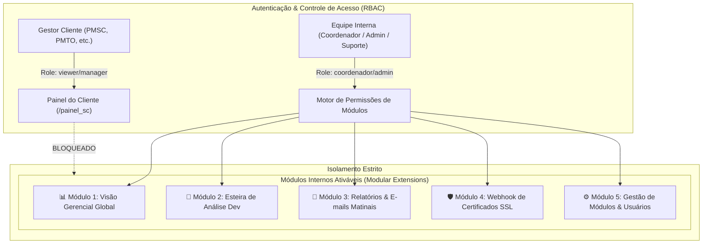
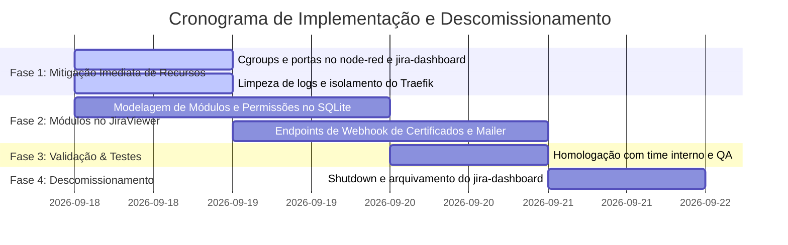

# 📋 Plano de Absorção Modular — Jira-Dashboard & Node-RED no egSYS JiraViewer

**Data:** 18 de Setembro de 2026  
**Autor:** Engenharia de Sustentação & Arquitetura egSYS  
**Status:** Aprovado para Execução  
**Alvos:** `jira-dashboard/`, `node-red/`, `traefik/` e expansão modular de `jiraview/`  
**Host de Produção:** `monitoramento-egsys` (`45.7.171.41`)  

---

## 🎯 1. Visão Geral e Alinhamento Estratégico

O **egSYS JiraViewer** foi concebido com uma dupla missão estratégica:
1. **Painel do Cliente (Externo):** Área estritamente controlada para os gestores estaduais (PMSC, PMTO, PMAM, SESDEC, PMPR, PMMT, GM), provendo visibilidade da esteira canônica de 8 etapas, cumprimento de SLAs e transparência operacional sem exposição de dados ou discussões internas.
2. **Painel de Operações & Coordenação (Interno):** Plataforma para liderança, coordenação técnica, suporte (N1/N2) e engenharia da egSYS acompanharem a operação global, gargalos e automações.

### O Problema Identificado
Historicamente, foram criados dois containers legados baseados em Node-RED:
* `jira-dashboard` (`egsys-noc-jira`): Criado para exibir dashboards gerenciais e enviar e-mails de tarefas em análise técnica.
* `node-red` (`node-red-messenger`): Criado para mensageria/triagem (Telegram Bot) e um painel de NOC.

Essas duas instâncias geraram dispersão de código, consumo excessivo de recursos, brechas de segurança (credenciais em texto puro), polling redundante na Atlassian Cloud a cada 20 segundos e conflito direto de domínio no Traefik (`suporte-monitor.egsys.siseg.tech`), que derrubou rotas de produção anteriormente.

### A Solução Canônica
Absorver integralmente as funcionalidades analíticas, de relatórios e webhooks dentro do **egSYS JiraViewer** por meio de uma **Arquitetura Modular Perfilada por Usuário**. 
> **Nota de Escopo:** Conforme diretriz institucional, toda a lógica de mensageria referente ao **Telegram Bot permanece isolada e intocada** no container `node-red-messenger`, aplicando-se apenas contenção de recursos (cgroups) e higiene de logs.

---

## 🔍 2. Matriz de Auditoria e Riscos dos Projetos Legados

| Componente / Projeto | Achado Crítico | Impacto Operacional | Ação de Mitigação / Destino |
| :--- | :--- | :--- | :--- |
| **jira-dashboard** (`egsys-noc-jira`) | Label Traefik disputa `Host(suporte-monitor.egsys.siseg.tech)` com o JiraViewer | Causa respostas `Cannot GET /coordenador` em produção se Traefik balancear | **Remover label** imediatamente e descomissionar container após migração |
| **jira-dashboard** (`egsys-noc-jira`) | Porta `1890:1880` aberta publicamente para `0.0.0.0` no host | Exposição desnecessária do painel Node-RED na internet | **Fechar porta pública**; tráfego apenas via rede interna Docker |
| **jira-dashboard** (`docker-compose.yml`) | Credenciais e tokens pessoais em texto plano (`JIRA_TOKEN`, `JIRA_USER`, `DIFY_API_KEY`) | Vazamento de credenciais corporativas no manifesto | **Sanitizar** para `.env` com permissão restrita |
| **jira-dashboard & node-red** | Polling agressivo a cada 20s para a API Jira Cloud em 3 abas distintas | Risco iminente de HTTP 429 (Too Many Requests / Blocklist Atlassian) | **Eliminar polling redundante**; JiraViewer já possui cache unificado |
| **jira-dashboard & node-red** | Sem limites de recursos no Docker (`mem_limit`, `cpus`, `pids_limit`) | Podem alocar até os 15.58 GiB do host, com risco de OOM derrubar Dify/Loki | **Aplicar Cgroups Canônicos** (512M / 1.0 CPU) |
| **node-red** (`node-red-messenger`) | Arquivo `bot_logs.txt` com **31.5 MB** sem rotação de log | Esgotamento gradual do storage do servidor de monitoramento | **Truncar arquivo** e configurar rotação no log do container |
| **node-red** (`redis-db-egsys`) | Redis rodando sem senha na rede Docker | Acesso não autenticado a chave-valor interno | **Adicionar requirepass** |

---

## 🏗️ 3. Arquitetura Modular Perfilada do JiraViewer

Para que o JiraViewer absorva as funções sem poluir o painel dos clientes, implementa-se o conceito de **Módulos Internos Ativáveis por Perfil/Usuário (Feature Modules & RBAC)**.



### Especificação dos Módulos Internos:

#### 1. Módulo 1: Visão Gerencial Global (Absorve Aba 1 do jira-dashboard)
* **Objetivo:** Consolidação multi-estado em tempo real de chamados pendentes (AM, TO, SC, PR, RO, MT, GM, CBM-PR).
* **Entrega:** Nativamente provido pela rota `/coordenador`, com ordenação por criticidade, SLA de resposta e distribuição por estado.
* **Permissão padrão:** Perfis `coordenador` e `admin`.

#### 2. Módulo 2: Esteira de Análise de Desenvolvimento (Absorve Aba 3 do jira-dashboard)
* **Objetivo:** Filtrar exclusivamente tarefas com status `Análise de Desenvolvimento` nos projetos de sustentação e engenharia criadas nos últimos 60/100 dias.
* **Entrega:** Visão tabular com indicador de dias em aberto, responsável técnico egSYS e impedimentos.
* **Permissão padrão:** Perfis `coordenador`, `admin` e `engenharia`.

#### 3. Módulo 3: Relatórios Automatizados & E-mails Matinais (Absorve Aba 2 do jira-dashboard)
* **Objetivo:** Substituir a rotina legada do Node-RED que disparava às 07h50 via e-mail pessoal (`joaosopran84@gmail.com`).
* **Entrega:**
  * Serviço backend assíncrono em Python (`app/core/reports_mailer.py`) integrado ao SMTP corporativo institucional.
  * Endpoint manual e agendador automático diário (07h50) que compila as tarefas em Análise de Desenvolvimento e dispara o relatório executivo formatado em HTML responsivo.
  * Lista de destinatários configurável via interface administrativa (ex: `joao.sopran@egsys.com.br`, `alexandre.publio@egsys.com.br`, `coordenacao@egsys.com.br`).
* **Permissão padrão:** Perfis `admin` e `coordenador`.

#### 4. Módulo 4: Webhook de Certificados SSL (Absorve Aba 4 do jira-dashboard)
* **Objetivo:** Receber alertas de monitoramento externo sobre a validade de certificados SSL de todos os servidores estaduais da egSYS.
* **Entrega:**
  * Endpoint seguro `POST /api/v1/webhooks/certificates-alert` no JiraViewer protegido por token de webhook (`X-Webhook-Secret`).
  * Processamento de certificados expirados ou com vencimento crítico (< 15 dias), com disparo imediato de alerta aos administradores.
* **Permissão padrão:** Acesso via token de máquina; visualização para `admin`.

#### 5. Módulo 5: Gestão de Módulos e Usuários
* **Objetivo:** Permitir ao Administrador Geral ativar ou desativar distintamente a visibilidade e o acesso a cada módulo para usuários internos específicos.
* **Entrega:** Tabela de permissões modulares no banco SQLite `auth.db`, associando `usuario_id` ou `role` às tags `["visao_gerencial", "analise_dev", "relatorio_email", "certificados_alert"]`.

---

## 🛡️ 4. Plano de Execução em 4 Fases



### Fase 1: Mitigação Imediata de Recursos no Servidor (Zero Downtime)
1. **Traefik:** Remover a label `traefik.http.routers.noc-jira.rule` do `jira-dashboard` para sanar de forma definitiva qualquer risco de sequestro de tráfego do `suporte-monitor.egsys.siseg.tech`.
2. **Porta Pública:** Desativar a exposição externa `1890:1880` do `jira-dashboard`.
3. **Cgroups:** Injetar limites estritos de CPU (1.0) e Memória (512MB) no `node-red/docker-compose.yml` e `jira-dashboard/docker-compose.yml`.
4. **Armazenamento:** Truncar o arquivo `bot_logs.txt` (31.5MB) no `node-red` e garantir que não haja crescimento infinito.

### Fase 2: Implementação dos Módulos no JiraViewer
1. **Estrutura de Permissões:**
   * Adicionar no banco `auth.db` campo/tabela de `user_modules` para controle granular por usuário.
2. **Módulo de E-mail (Relatório Matinal 07h50):**
   * Criar `backend/app/core/reports_mailer.py` e endpoint `/api/v1/modules/reports/trigger`.
3. **Módulo de Webhook de Certificados:**
   * Criar `backend/app/api/webhooks.py` com a rota `POST /api/v1/webhooks/certificates-alert`.
4. **Interface Interna:**
   * Adicionar no painel `/coordenador` barra de navegação superior para alternar entre os módulos ativos do usuário logado.

### Fase 3: Homologação e Validação
1. Validar que usuários do perfil cliente (`gestor.sc`, etc.) continuam tendo acesso exclusivo a `/painel_sc`, sem nenhum vislumbre dos módulos internos.
2. Validar que o relatório das 07h50 é entregue com o layout executivo oficial da egSYS via canal institucional.
3. Validar recepção de alertas de certificados SSL.

### Fase 4: Descomissionamento e Arquivamento
1. Realizar backup integral final de `/var/egsys-docker/container/jira-dashboard/data`.
2. Executar `docker compose down` no projeto `jira-dashboard`.
3. Manter o `node-red` rodando **estritamente o container do Telegram Bot**, contido e monitorado.

---

## 📊 5. Parâmetros de Contenção Canônica (Docker Compose)

### A. Para `node-red/docker-compose.yml` (Após Mitigação):
```yaml
services:
  node-red:
    image: nodered/node-red:latest
    container_name: node-red-messenger
    restart: unless-stopped
    environment:
      - TZ=America/Sao_Paulo
      - NODE_RED_PORT=1880
    volumes:
      - ./node-red-data:/data
    depends_on:
      - redis-db
    networks:
      - webproxy
      - internal
    logging:
      driver: "json-file"
      options:
        max-size: "10m"
        max-file: "3"
    mem_limit: 512m
    mem_reservation: 128m
    cpus: 1.0
    cpu_shares: 512
    pids_limit: 150
    security_opt:
      - no-new-privileges:true
    labels:
      - "traefik.enable=true"
      - "traefik.http.routers.node-red.rule=Host(`mesenger.egsys.siseg.tech`)"
      - "traefik.http.routers.node-red.entrypoints=websecure"
      - "traefik.http.routers.node-red.tls.certresolver=letsencrypt"
      - "traefik.http.services.node-red.loadbalancer.server.port=1880"

  redis-db:
    image: redis:alpine
    container_name: redis-db-egsys
    restart: always
    volumes:
      - redis-data:/data
    networks:
      - internal
    command: redis-server --appendonly yes
    logging:
      driver: "json-file"
      options:
        max-size: "10m"
        max-file: "3"
    mem_limit: 256m
    mem_reservation: 64m
    cpus: 0.5
    cpu_shares: 256
    pids_limit: 50
    security_opt:
      - no-new-privileges:true

networks:
  webproxy:
    external: true
  internal:
    driver: bridge

volumes:
  node-red-data:
  redis-data:
```

---

## 🔒 6. Matriz de Segurança e Perfilamento (RBAC)

| Perfil / Papel | Público | Acesso ao Painel Cliente | Acesso à Visão Gerencial | Acesso à Análise Dev | Relatórios E-mail | Gestão de Módulos |
| :--- | :--- | :---: | :---: | :---: | :---: | :---: |
| **Cliente Estadual (PMSC, etc.)** | Externo | ✅ Sim (`/painel_sc`) | ❌ Não | ❌ Não | ❌ Não | ❌ Não |
| **Suporte N1 / N2** | Interno | ✅ Sim (Diagnóstico) | ✅ Sim (Somente Leitura) | ❌ Não | ❌ Não | ❌ Não |
| **Engenharia / Sustentação** | Interno | ❌ Não prioritário | ✅ Sim | ✅ Sim | ❌ Não | ❌ Não |
| **Coordenador Geral** | Interno | ✅ Sim (`/painel_sc`) | ✅ Sim (`/coordenador`) | ✅ Sim | ✅ Sim | ❌ Não |
| **Administrador Geral** | Interno | ✅ Sim (Todos) | ✅ Sim (Todos) | ✅ Sim | ✅ Sim | ✅ Sim (Configura) |

---
*Documento registrado na base canônica do egSYS JiraViewer em `docs/PLANO_ABSORCAO_JIRA_DASHBOARD_NODE_RED_MODULAR.md`.*
