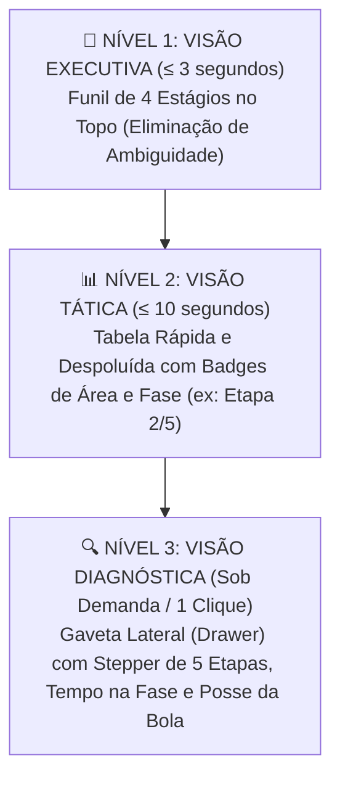
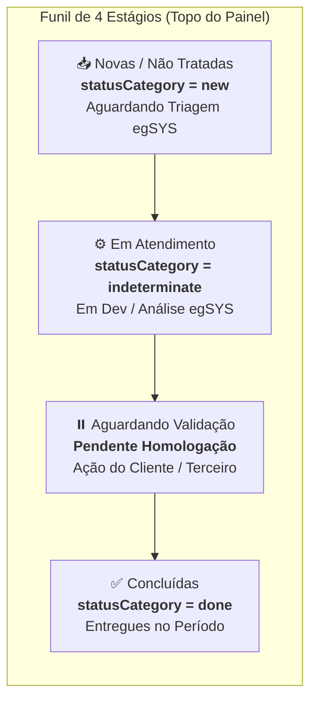
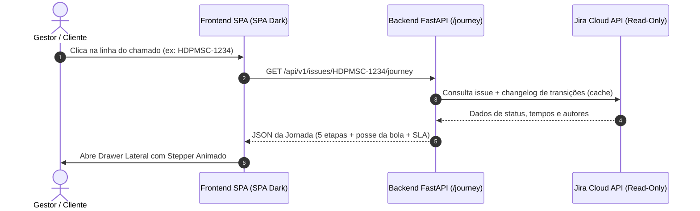

# 🏛️ RELATÓRIO EXECUTIVO — ARQUITETURA DE OBSERVABILIDADE & EXPERIÊNCIA DO CLIENTE
## Padrão Canônico de Transparência, Funil de Atendimento e Jornada do Ticket no egSYS JiraView

- **Data**: 2026-09-09
- **Versão do Documento**: 1.0.0
- **Classificação**: Documentação Técnica & Executiva de Produto (egSYS JiraView)
- **Status**: Aprovado para o Roadmap v0.2
- **Público-Alvo**: Diretoria egSYS, Gestores de TI de Clientes Públicos (PMSC, PMTO, PMAM, etc.) e Engenharia de Software

---

## Executive Summary (Resumo Executivo)

O **egSYS JiraView** foi concebido para superar as limitações crônicas de portais legados (Node-RED `noc-jira` e interfaces nativas rígidas do JSM), oferecendo uma experiência moderna, segura e com contenção estrita em **1 container único multi-estado**.

Este relatório formaliza o novo padrão de **Observabilidade Simplificada e Objetiva**, projetado para responder às 3 perguntas fundamentais de qualquer gestor ou cliente em menos de **3 segundos**:
1. *Quantos chamados estão realmente aguardando início pela egSYS?*
2. *De quem é a responsabilidade pela próxima ação ("Posse da Bola")?*
3. *Onde o chamado está parado e há quanto tempo?*

---

## 1. 🔍 O Problema Raiz & Diagnóstico da Experiência Anterior

### 1.1. Ambiguidade do Conceito de "Chamados Abertos"
Nos portais tradicionais, o termo genérico *"Solicitações Abertas"* agrupa indistintamente:
- Chamados recém-criados pelo cliente que ainda não passaram por triagem.
- Chamados em pleno desenvolvimento técnico pela equipe egSYS.
- Chamados prontos aguardando homologação ou testes pelo próprio cliente.
- Chamados bloqueados por dependência de infraestrutura do cliente.

**Impacto Negativo**: O gestor do cliente interpretava que dezenas de chamados estavam "esquecidos" pela egSYS, quando na realidade muitos aguardavam validação da sua própria equipe.

### 1.2. Sobrecarga Cognitiva e Poluição Visual
Tentativas anteriores de exibir todas as colunas de histórico, múltiplos status técnicos e dados de tramitação diretamente na tabela principal geravam o efeito *"Planilha Pesada"*, dificultando a rápida tomada de decisão e tornando a navegação lenta.

### 1.3. Truncamento Matemático
O endpoint `/meta` aplicava limite de amostragem estático em 100 itens (`max_results=100`), gerando divergência entre a soma do dropdown de filtros e o total consolidado dos cards do topo.

---

## 2. 🧭 A Solução: Os 3 Níveis Cognitivos de Observabilidade

A nova arquitetura distribui a informação em **3 camadas de densidade progressiva**, garantindo que o cliente obtenha a resposta exata sem esforço cognitivo desnecessário.

---

### Nível 1: Visão Executiva — Funil de Atendimento em 4 Estágios

Substituição definitiva do card genérico "Abertas" por 4 métricas soberanas baseadas nas categorias do Jira:

| Estágio no Painel | Categoria Jira (`statusCategory`) | Significado Operacional para o Cliente | Cor Semântica |
|---|---|---|---|
| **📥 Novas / Não Tratadas** | `new` | Chamados recém-abertos pelo cliente que aguardam triagem/início da egSYS. | 🔵 Azul Neutro (`#388bfd`) |
| **⚙️ Em Atendimento** | `indeterminate` | Chamados ativamente em análise, engenharia ou sustentação técnica egSYS. | 🟣 Roxo / Âmbar (`#a371f7`) |
| **⏸️ Aguardando Validação** | `indeterminate` (com trava/espera) | Chamados pausados aguardando teste, resposta ou homologação do cliente/órgão. | 🟡 Amarelo Alerta (`#d29922`) |
| **✅ Concluídas** | `done` | Chamados entregues com resolução formal no período selecionado. | 🟢 Verde Sucesso (`#3fb950`) |

---

### Nível 2: Visão Tática — Tabela Principal Rápida e Despoluída

A tabela de chamados permanece veloz, limpa e responsiva. Em vez de dezenas de colunas sobrecarregadas, adicionam-se apenas duas **badges inteligentes de alto valor**:

1. **Badge de Área (`🏷️ SADE`, `🏷️ Cidadão`, `🏷️ Integração`, `🏷️ Operações`)**: Permite identificar imediatamente a frente de produto impactada.
2. **Badge de Macro-Fase (`📊 Etapa 2/5`)**: Resume visualmente em qual fase do ciclo de vida o ticket se encontra.

---

### Nível 3: Visão Diagnóstica — Gaveta Lateral (Drawer — "Jornada do Ticket")

Ao clicar em qualquer linha da tabela principal, uma gaveta desliza suavemente a partir da lateral direita, sem perda de contexto e sem recarregar a tela.

#### Componentes Estruturais do Drawer:
1. **Stepper Visual de 7 Etapas**:
   - `1. Triagem (N1)` ➔ `2. Triagem (N2)` ➔ `3. Análise de Desenvolvimento` ➔ `4. Em Desenvolvimento` ➔ `5. Validação Interna / QA` ➔ `6. Validação / Homologação Cliente` ➔ `7. Concluído`.
2. **Indicador Explícito de "Posse da Bola"**:
   - `🔵 Ação com a egSYS`: Ex: *"Em desenvolvimento pelo time SADE desde 08/09"*.
   - `🟡 Ação com o Cliente`: Ex: *"Aguardando homologação e teste pela equipe PMSC há 3 dias"*.
3. **Métrica de Gargalo ("Tempo na Etapa Atual")**:
   - Exibe o tempo de permanência na fase atual comparado ao tempo total de vida do ticket, permitindo identificar gargalos imediatamente.
4. **Trilha de Auditoria (Linha do Tempo de Movimentações)**:
   - Histórico cronológico das passagens de bastão extraído diretamente do changelog do Jira.

---

## 3. 📊 Matriz Comparativa: Antes vs. Depois

| Critério de Avaliação | Modelo Tradicional (JSM / Legado) | Novo Padrão egSYS JiraView | Ganho Estratégico |
|---|---|---|---|
| **Tempo para Entendimento Global** | 2 a 5 minutos (cruzando relatórios) | **≤ 3 segundos** (Funil 4 Estágios) | Redução de 95% no tempo de análise executiva |
| **Clareza de Responsabilidade** | Indeterminada (gerava atrito e cobranças) | **Posse da Bola Explícita** (`egSYS` vs `Cliente`) | Eliminação de atrito operacional e reuniões de alinhamento |
| **Poluição Visual** | Alta (tabelas densas com scroll horizontal) | **Zero Poluição** (Detalhes sob demanda no Drawer) | Interface limpa, executiva e altamente amigável |
| **Identificação de Gargalos** | Apenas data de abertura total | **Tempo na Etapa Atual vs Tempo Total** | Gestão de SLA por fase do ciclo de atendimento |
| **Precisão Numérica** | Truncada em 100 status | **Agregação Soberana Paginada** | Confiabilidade matemática absoluta |

---

## 4. 🔒 Conformidade com as 7 Invariantes Canônicas (Padrão Orion)

1. **1 Container Único = Todos os Estados**: Zero duplicação de infraestrutura. Novos estados (TO, AM, PR, GM) ativados exclusivamente via `deploy/estados.yaml`.
2. **Zero Credenciais no Client**: Credenciais de API do Jira encapsuladas no backend em variáveis de ambiente protegidas (`chmod 600`).
3. **RBAC Granular por Estado**: Isolamento estrito de visibilidade (`viewer` < `manager` < `admin`).
4. **API Jira Read-Only**: O painel atua como camada de observabilidade segura, sem mutações não autorizadas.
5. **Sanitização Dual-Path**: Separação compulsória entre código de produto (`egsys-dev/jiraview.git`) e histórico privado.
6. **Hardening Cgroups**: Contenção rigorosa (512MB RAM / 1.0 CPU / 150 PIDs / no-new-privileges).
7. **Design Não-Destrutivo & Docs-as-Code**: Toda evolução técnica é precedida de documentação formal, histórico cumulativo e testes verificáveis.

---

## 5. 🚀 Próximos Passos de Engenharia (Roadmap v0.2)

1. **Backend**:
   - Refatorar endpoint `/meta` para calcular contagens via agregação paginada completa.
   - Implementar endpoint `/api/v1/issues/{key}/journey` consumindo o changelog de transições do Jira.
2. **Frontend**:
   - Substituir o grid de cards do topo pelo **Funil de 4 Estágios**.
   - Adicionar o componente de **Gaveta Lateral (Drawer)** com animação CSS suave e suporte nativo ao Modo Escuro.
   - Incluir filtro rápido por **Posse da Bola** (`[Todos] [Ação egSYS] [Ação Cliente]`).
3. **Quality Gate & Deploy**:
   - Validação da suíte de testes e deploy no host `monitoramento-egsys` sob Traefik `/painel_sc`.
